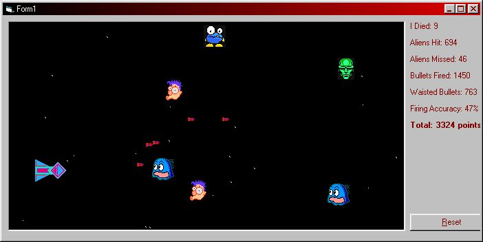



## Shoot Aliens \(simple game using BitBlt\)

### Description

This will show you a simple way to make a game. This is entirely made using the BitBlt API and setpixel API for the back ground stars... check it out, kinda spiffy
 
### More Info
 

             |
---                |---
**Submitted On**   |2000-10-14 15:48:54
**By**             |[Andrew Heinlein \(Mouse\)](https://github.com/Planet-Source-Code/PSCIndex/blob/master/ByAuthor/andrew-heinlein-mouse.md)
**Level**          |Beginner
**User Rating**    |4.8 (19 globes from 4 users)
**Compatibility**  |VB 5\.0, VB 6\.0
**Category**       |[Graphics](https://github.com/Planet-Source-Code/PSCIndex/blob/master/ByCategory/graphics__1-46.md)
**World**          |[Visual Basic](https://github.com/Planet-Source-Code/PSCIndex/blob/master/ByWorld/visual-basic.md)
**Archive File**   |[CODE\_UPLOAD1065910142000\.zip](https://github.com/Planet-Source-Code/andrew-heinlein-mouse-shoot-aliens-simple-game-using-bitblt__1-12057/archive/master.zip)

